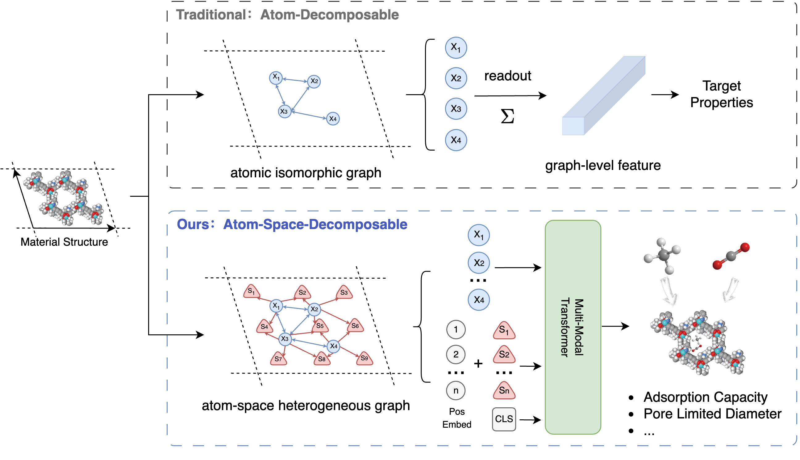
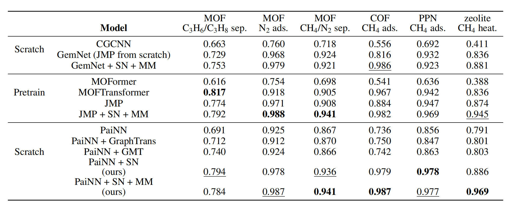
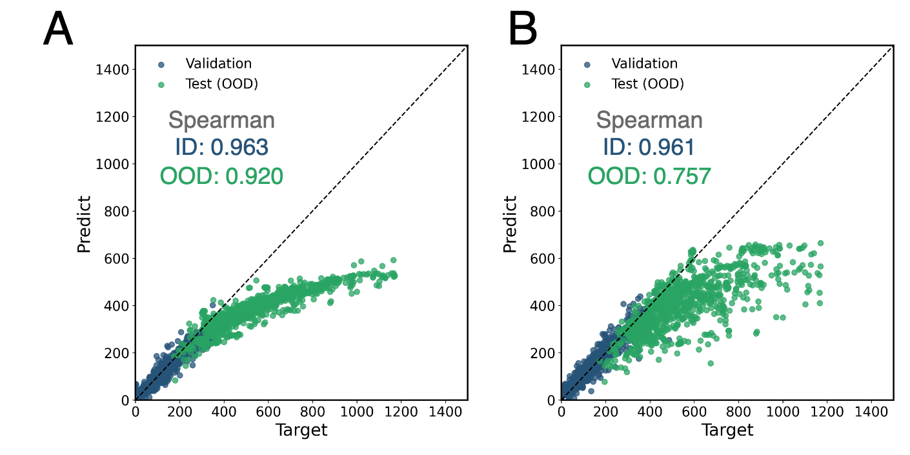
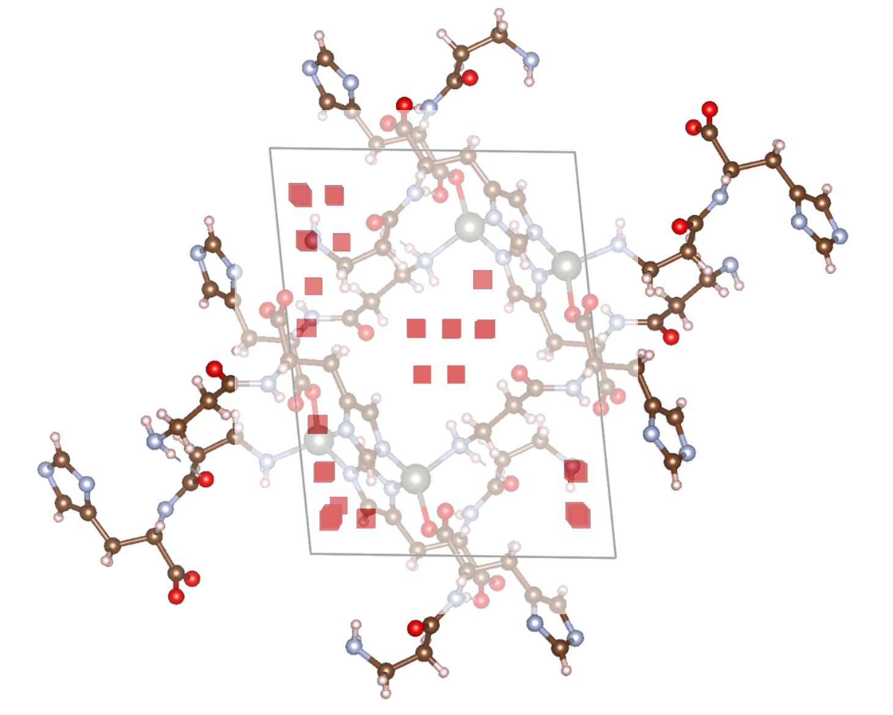
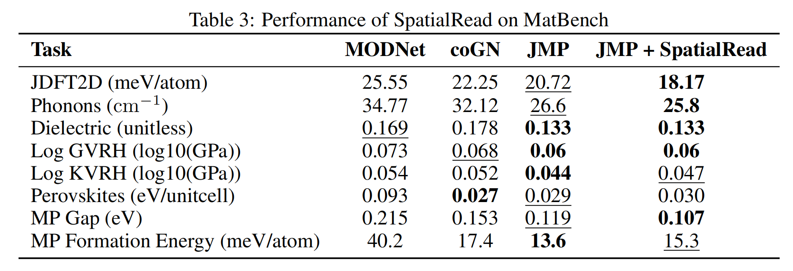

# SpatialRead

Official implementation of the paper:  
**[From atom to space: A region-based readout function for spatial properties of materials](https://openreview.net/forum?id=v2oYZJ7Exo)**.

SpatialRead is a readout framework for MPNNs that targets **spatially distributed material properties** (for example, gas adsorption and void fraction).

## Overview

Many spatial properties are naturally determined by **regions** in a crystal rather than by individual atoms.  
For porous materials (such as MOFs), gas adsorption can be viewed as the sum of contributions from local regions (for example, pore regions). Standard GNN readouts usually aggregate only atom-level features, which can mismatch this spatial nature.

SpatialRead addresses this by adding **spatial nodes** to the atom graph:

- Spatial nodes are sampled in the lattice, and each node represents a local region.
- Message passing is directed from atom nodes to spatial nodes.
- Final property prediction is performed from spatial-node features.

Reported benefits in the paper include:

- Stronger performance on porous materials (especially MOFs, COFs, and zeolites), with about **15%** error reduction at around **30%** extra compute.
- Better OOD generalization, with roughly **+0.2** Spearman correlation in OOD settings.
- Better interpretability, where important spatial nodes align with pore-related regions.

## Scope and Limitations

This repository is primarily designed for **MOF** tasks.  
While COFs and zeolites can also benefit, improvements are **not guaranteed** for all crystal-property prediction tasks.

## Architecture



## Evaluation

### Spatial Properties


### OOD


### Interpretability


### MatBench


## Installation

```bash
conda create -n spatialread python=3.10 -y
conda activate spatialread

pip install -r requirements.txt

# PyG extensions (CUDA 12.4 + torch 2.6.0)
pip install pyg_lib torch_scatter torch_sparse torch_cluster torch_spline_conv \
  -f https://data.pyg.org/whl/torch-2.6.0+cu124.html
pip install torch_geometric
```

## Quick Start (Provided Test Data)

Test data is included under `data/test`.

1. Build base PyG graphs:

```bash
python -m spatialread.data.build_graph --config ./configs/test.yaml
```

2. Build edges for atom graphs and spatial-node graphs:

```bash
python -m spatialread.data.build_edge --config ./configs/test.yaml --devices cuda:0
python -m spatialread.data.build_edge --config ./configs/test.yaml --devices cuda:0 --sp
```

3. Train and evaluate:

```bash
python -m spatialread.finetune train --config ./configs/test.yaml
```

## Using Your Own Data

Set `data.root_dir` and related fields in your config file (see `configs/test.yaml` and `spatialread/config/config.yaml`).

Expected files under `data.root_dir`:

- `cif/*.cif`
- `benchmark.csv` (or your custom CSV name), including:
  - `matid` column
  - target column matching `train.task_name`

Optional split files:

- `benchmark.train.csv`
- `benchmark.val.csv`
- `benchmark.test.csv`

If split files are absent, the code can split from the base CSV automatically.

## Notes

- `--devices` accepts a comma-separated list (for example, `cuda:0,cuda:1`) for edge preprocessing.
- Training logs and checkpoints are written to the path defined by `train.log_dir` in the config.
